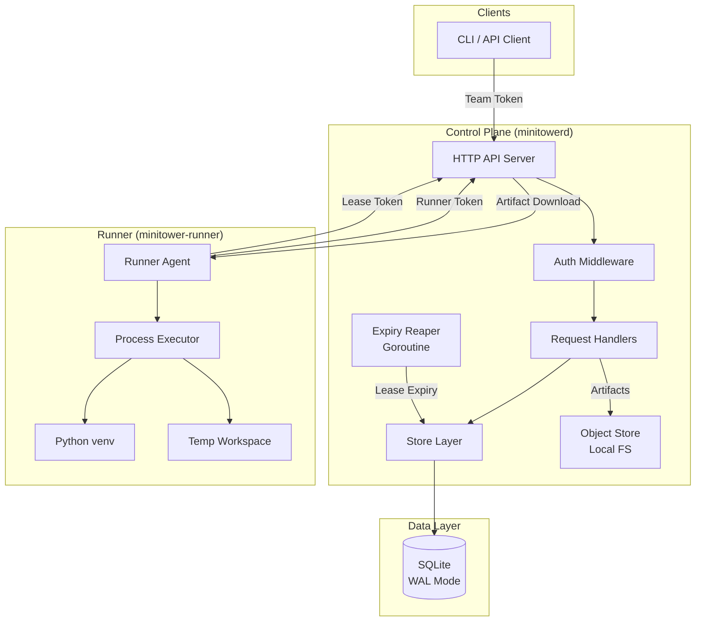
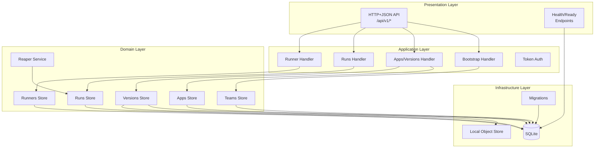
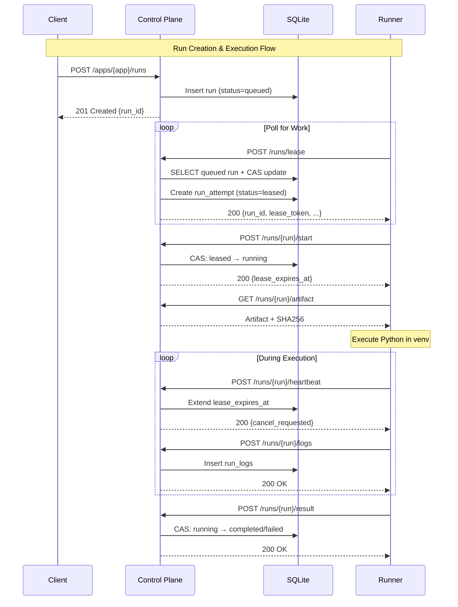
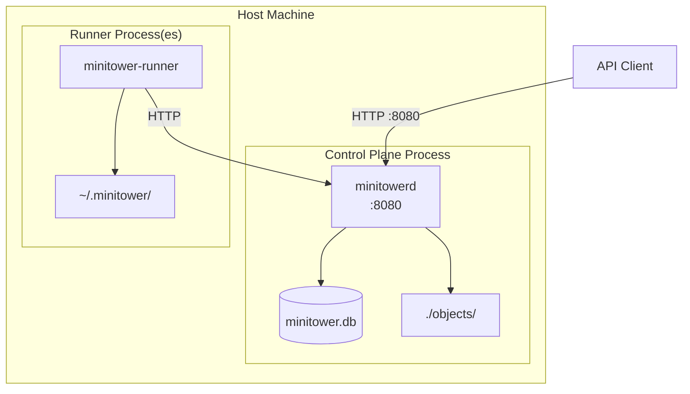
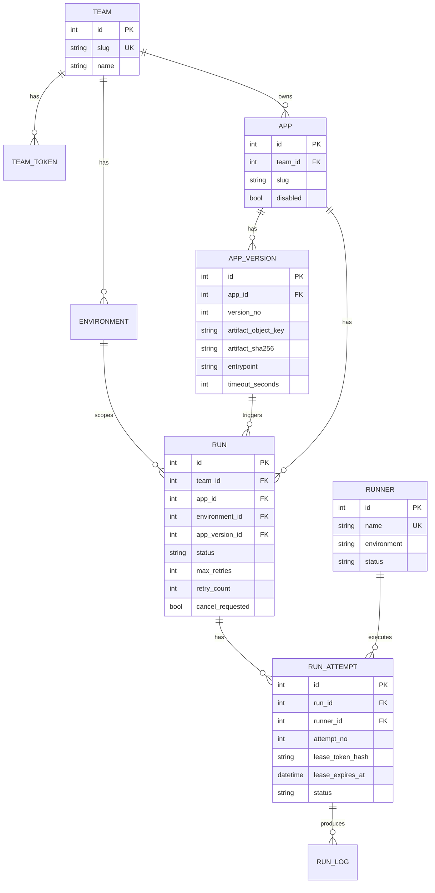

# MiniTower Architecture

This document contains architecture diagrams for the MiniTower orchestration system.

## Table of Contents

- [Component Architecture](#component-architecture)
- [Layered Architecture](#layered-architecture)
- [Run Lifecycle Sequence](#run-lifecycle-sequence)
- [Deployment Topology](#deployment-topology)
- [Data Model](#data-model)
- [ASCII Diagram](#ascii-diagram)

---

## Component Architecture

High-level view of system components and their interactions.



---

## Layered Architecture

Code organization showing architectural layers and dependencies.



---

## Run Lifecycle Sequence

Complete flow from run creation through execution and completion.



---

## Deployment Topology

Physical deployment structure for a single-host setup.



---

## Data Model

Entity relationship diagram showing database schema.



---

## ASCII Diagram

Terminal-friendly representation for plain-text documentation.

```
┌─────────────────────────────────────────────────────────────────────┐
│                         MINITOWER ARCHITECTURE                       │
├─────────────────────────────────────────────────────────────────────┤
│                                                                      │
│   ┌──────────────┐         HTTP/JSON           ┌──────────────────┐ │
│   │  API Client  │ ──────────────────────────▶ │  Control Plane   │ │
│   │  (Team Token)│                             │   (minitowerd)   │ │
│   └──────────────┘                             │                  │ │
│                                                │  ┌────────────┐  │ │
│                                                │  │  HTTP API  │  │ │
│   ┌──────────────┐         HTTP/JSON           │  ├────────────┤  │ │
│   │    Runner    │ ◀─────────────────────────▶ │  │  Handlers  │  │ │
│   │(Runner Token)│                             │  ├────────────┤  │ │
│   │              │                             │  │   Store    │  │ │
│   │ ┌──────────┐ │                             │  ├────────────┤  │ │
│   │ │ Executor │ │                             │  │   Reaper   │  │ │
│   │ │ (Python) │ │                             │  └────────────┘  │ │
│   │ └──────────┘ │                             │        │         │ │
│   │ ┌──────────┐ │                             │        ▼         │ │
│   │ │  venv    │ │                             │  ┌────────────┐  │ │
│   │ └──────────┘ │                             │  │  SQLite    │  │ │
│   └──────────────┘                             │  │  (WAL)     │  │ │
│                                                │  └────────────┘  │ │
│                                                │        │         │ │
│                                                │        ▼         │ │
│                                                │  ┌────────────┐  │ │
│                                                │  │  Objects   │  │ │
│                                                │  │  (Local)   │  │ │
│                                                │  └────────────┘  │ │
│                                                └──────────────────┘ │
└─────────────────────────────────────────────────────────────────────┘

Run Status Flow:
  queued ──▶ leased ──▶ running ──▶ completed
    │           │           │
    │           │           ▼
    │           │      cancelling ──▶ cancelled
    │           │           │
    ▼           └─────┬─────┘
  cancelled          ▼
  (pre-lease)       dead
                  (retries exhausted)
```

---

## Diagram Usage Guide

| Diagram | Best For |
|---------|----------|
| **Component** | High-level system overview, onboarding docs |
| **Layered** | Understanding code organization, architectural boundaries |
| **Sequence** | Debugging flows, API documentation |
| **Deployment** | Ops runbooks, infrastructure docs |
| **ER Diagram** | Database schema discussions, data modeling |
| **ASCII** | Terminal presentations, plain-text docs |

## Rendering

These Mermaid diagrams render natively on GitHub. For other uses:

- **CLI**: `npx @mermaid-js/mermaid-cli -i architecture.md -o output.png`
- **Web**: Paste diagrams into [mermaid.live](https://mermaid.live)
- **VS Code**: Install "Markdown Preview Mermaid Support" extension
